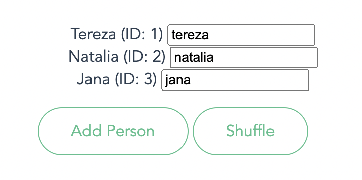

# Vue.js - Metódy, vlastnosť computed, zoznamy v-for, vlastnosť watch, sloty, podmienené vykreľovanie, v-show

## Metódy
K atribútu ``count`` modelu komponentu ``ButtonCounter`` sme doteraz pristupovali napriamo (``count++``):

```js
<template>
  <button @click="count++">{{ title }} {{ count }}-krát.</button>
  <input type="number" v-bind:value="count"/>
</template>
```

Z pohľadu udržateľnosti kódu a jeho prehľadnosti je lepšie pristupovať k modelu komponentu cez metódy. Na definovanie metód používame Vue vlastnosť ``methods: { }``. Zadefinujme v komponente ``ButtonCounter`` metódu ``increment()`` a použime ju pri udalosti ``@click="increment"``:

```js
<script>
export default {
  data() {
    return {
      count: 0
    }
  },
  methods: {
    increment() {
      this.count++
    }
  },
  props: {
    title: String,
    isActive: Boolean
  }
}
</script>

<template>
  <button :class="{ red : isActive }" @click="increment" v-html="title + ' ' + count"></button>
  <input type="number" v-bind:value="count"/>
</template>

<style scoped>
.red { 
  color: red
}
</style>
```

## Vlastnosť computed

Vlastnosť ``computed`` používame na definovanie **computed atribútov**. Ide o atribúty, ktorých hodnota závisí od iných atribútov. Ilustrujme si to na príklade. Pridajme do komponentu ``ButtonCounter`` vlastnosť ``computed``  s atribútom ``fullTitle``:

```js
  computed: {
    fullTitle: {
      get() {
        return this.title + ' ' + this.count
      }
    }
  },
```
Vidíme, že hodnota atribútu ``fullTitle`` závisí od ďalších dvoch atribútov ``title`` a ``count``. Computed atribút ``fullTitle`` je špeciálny v tom, že kedykoľvek sa zmení hodnota niektorého z atribútov, od ktorých je závislý, vtedy sa zmení/prepočíta aj jeho hodnota samotná. Ak sa teda zmení hodnota atribútu ``count``, zmení sa reaktívne aj hodnota computed atribútu ``fullTitle``. Podobne, ak sa zmení hodnota atribútu ``title``, zmení sa reaktívne aj hodnota computed atribútu ``fullTitle``.  

Navyše dochádza ku **cacheovaniu hodnoty computed atribútu**. To znamená, že hodnota atribútu sa neprepočítava pri každom volaní/použití. K opätovnému prepočítaniu dôjde až v momente, keď sa zmení hodnota niektorého zo závislých atribútov. Správnym použitím computed atribútov dokážeme významne zvýšiť efektivitu riešenia.  

Upravme ešte šablónu tak, že použijeme nový computed atribút ``fullTitle``:

```html
<template>
  <button :class="{ red : isActive }" @click="increment" v-html="fullTitle"></button>
  <input type="number" v-bind:value="count"/>
</template>
```

### Vlastnosť computed vs method
Ak by sme zadefinovali ``fullTitle`` ako štandardnú metódu v ``methods: { }``, pri každom jej volaní/použití by dochádzalo k výpočtu jej návratovej hodnoty, a teda získanie hodnôt závislých atribútov a ich konkatenácia. 

## Zoznamy v-for
Direktívu ``v-for`` používame na vytváranie zoznamov. Výraz má špeciálnu syntax vo forme``item in items``, kde ``items`` (persons) je pole a ``item`` (person) je element prislúchajúci aktuálnej iterácii:

```html
<ul>
  <li v-for="person in persons">{{ person.name }} (ID: {{ person.id }})</li>
</ul>
```

Direktíva ``v-for`` používa predvolene stratégiu **in-place patch**. V prípade, ak dôjde k preusporiadaniu pola (``persons``), Vue namiesto presúvania celých elementov (``li``) v DOMe robí lacnejšiu operáciu, a to "pláta" obsah elementov, ktorých sa zmena týka. Toto však so sebou môže priniesť neželané správanie. [Ilustrujme si to na tomto príklade](https://codepen.io/kurice/pen/ZEamyKw).

Vyplňme vstupné polia tak, aby meno vľavo zodpovedalo menu vo vstupnom poli. 


Kliknime na tlačidlo **Shuffle**. Vidíme, že hoci sa poradie elementov v poli ``persons`` mení, poradie vstupných polí zostáva stále rovnaké. Napriek tomu, že vstupné pole je súčasťouou HTML elementu ``li``, na ktorý je aplikovaná direktíva ``v-for``:

```html
<ul>
  <li v-for="p in persons">{{ p.name }} (ID: {{ p.id }}) <input type="text"></li>
</ul>
```


Ako sme spomenuli, je to spôsobené tým, že Vue nepresúva celé ``li`` elementy, ale fixuje ich obsah (fixne DOM element state), a teda časť ``{{ p.name }} (ID: {{ p.id }})`` (tieto informácie sú súčasťou tzv. application state - model/data - ktoré Vue sleduje). Vue preferuje pri tejto stratégii znovupoužiť čo najviac z DOMu, ako je to možné (optimalizácia na výkon). Avšak môže to viesť k neočakávanému správaniu pri dynamických zmenách používateľského rozhrania. 

Stratégia **in-place patch** nezafunguje, ak sú v obsahu elementov aj formulárové vstupné polia. Vstupné polia, resp. text napísaný v poliach je súčasťou tzv. temporary DOM state. 

Riešením je, že povieme Vue, aby pri zmene poradia položiek v poli, zrealizoval preusporiadanie na úrovni celých (``li``) elementov. Stačí, keď pridáme atribút ``:key="item.id"`` (``v-bind:key``), kde ``item.id`` je unikátnym kľúčom (identifikátorom) pre každú z položiek zoznamu. Pridaním kľúča začne Vue rozpoznávať každý element (``li``) a jeho DOM state. Temporary DOM state každého z elementov sa stane súčasťou application state. Kľúčom môžu byť jednoduché hodnoty (reťazce, čísla), nepoužívame objekty.

```html
<ul>
  <li v-for="p in persons" :key="p.id"{{ p.name }} (ID: {{ p.id }}) <input type="text"></li>
</ul>
  ```

Poznámka: Preusporiadanie, resp. manipulácia s celými elementami na úrovni DOMu je spravidla náročnejšia operácia, a preto treba pristupovať k tomuto problému vždy individuálne.


## Domáca úloha

1. Vyskúšajte si rozdiel medzi vlastnosťami [computed a watch](https://guivern.hashnode.dev/vue-js-differences-between-computed-and-watch).
2. Vyskúšajte si použitie [slotov](https://vuejs.org/guide/components/slots.html#slot-content-and-outlet).
3. Vyskúšajte si prácu s direktívami na podmienené vykresľovanie: [v-if, v-else, v-else-if](https://v2.vuejs.org/v2/guide/conditional.html)
4. Vyskúšajte rozdiel medzi direktívami [v-if a v-show](https://mattmaribojoc.medium.com/v-if-vs-v-show-vue-conditional-rendering-86ca39a8b322). Osvojte si prípady použitia, kedy je ktorá z dvojice direktív efektívnejšia.